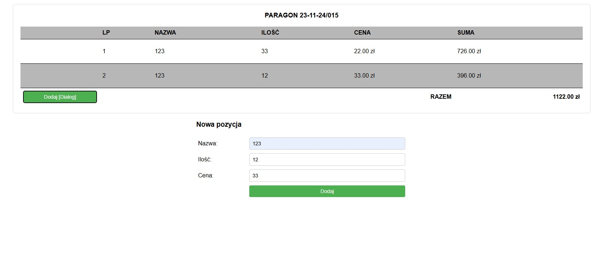
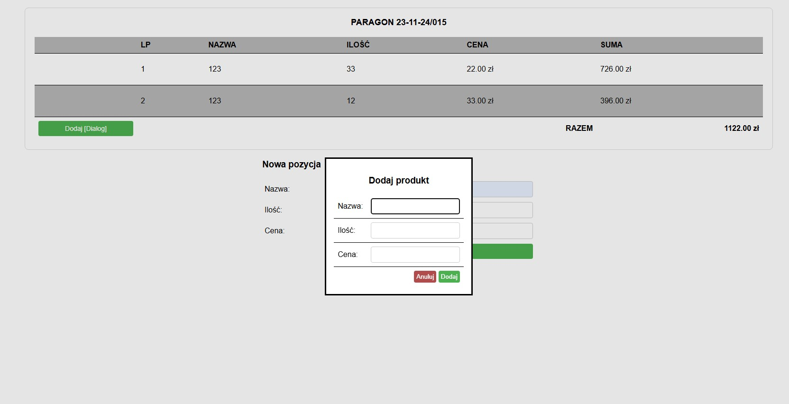
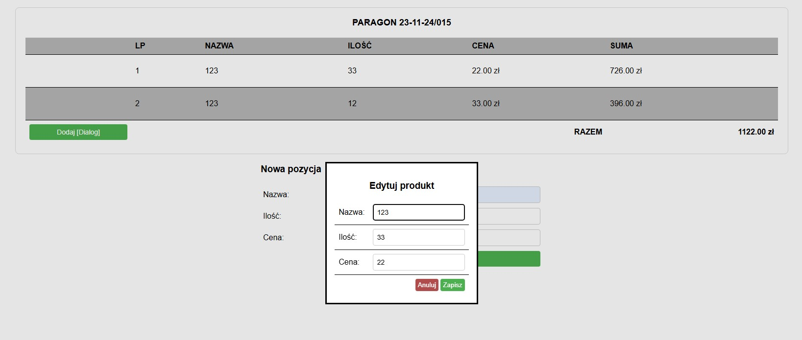
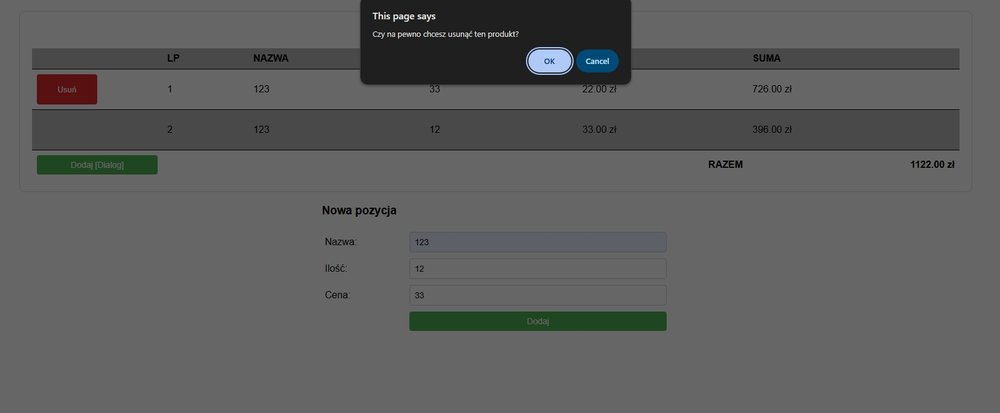

# 🧾 Receipt Manager – Plain JavaScript Project

This project demonstrates how to manage and display receipt data using **only Plain JavaScript**, progressively evolving from local storage to a full backend with Express.js.

---

## 📦 Project Structure

The solution is divided into **three parts**, each representing a progressively more advanced implementation:

### ./01/ - Local Storage

Manage a receipt using only client-side logic with **Local Storage**.

### ./02/ - Json Server

Migrate data storage to a mock REST API using **json-server** and `fetch()`.

### ./03 - Express Backend

Replace the mock API with a **custom Express.js backend** to provide real CRUD operations.

---

## 💡 Functional Overview

Each version of the application allows the user to:

- Add new receipt entries (product name, unit price, quantity).
- Edit existing entries using a modal dialog.
- Delete entries with confirmation.
- Display an automatically calculated total.

The application ensures **data validation** (e.g., no negative prices or quantities) and respects good UI/UX practices.

---

## 🧠 Data Model

Each receipt entry is an object of the following structure:

```json
{
      "id": "50ba90b8-63c8-441e-85b0-3181464267dc",
      "name": "test",
      "amount": 1,
      "price": 12.2
}
````

The full receipt is represented as an array of such objects, kept **in sync** with both the UI and the current storage layer (localStorage, json-server, or Express backend).

---

## 🧩 Key Technologies

| Version | Technologies Used                                  |
| ------- | -------------------------------------------------- |
| 01      | HTML, CSS, Vanilla JS, LocalStorage                |
| 02      | HTML, CSS, Vanilla JS, `fetch()`, json-server      |
| 03      | HTML, CSS, Vanilla JS, `fetch()`, Node.js, Express |

---

## 🛠 Features and Highlights

* ✅ Dynamic DOM generation based on the data model.
* 🔁 Two-way data binding (model ↔️ view).
* 💾 Persistent state (localStorage / API).
* 🔐 Input validation.
* 🧩 Modular code structure.

---

## 📸 Screenshots

### 📋 Main Receipt View



### ➕ Adding a New Item via Dialog



### ✏️ Editing an Existing Item



### 🗑️ Delete Confirmation Prompt

